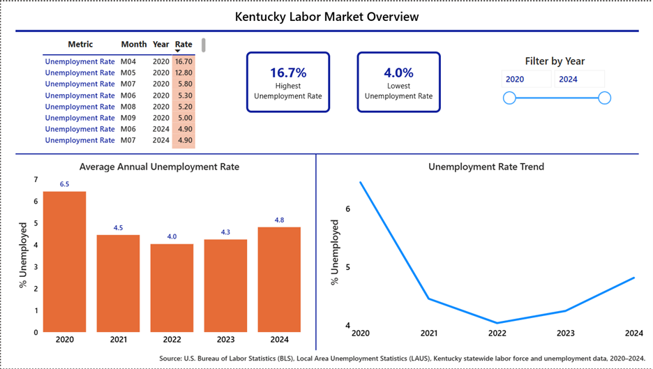
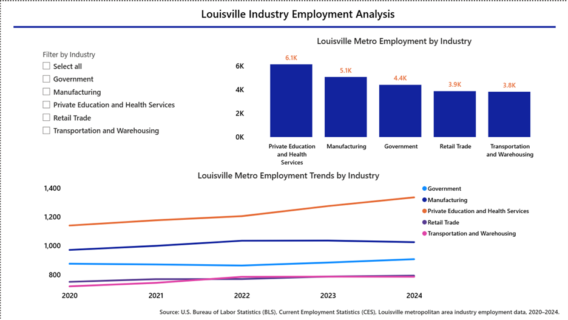

# BLS-Labor-Market-Monitor
Pipelines project using BLS labor market data, PostgreSQL, and Power BI dashboards for Kentucky and Louisville workforce analysis.
# Louisville Labor Market Analysis

## Project Overview

This project develops an end-to-end labor market analytics pipeline using the U.S. Bureau of Labor Statistics (BLS) API, Python, PostgreSQL, and Power BI. The project analyzes Kentucky labor market indicators and Louisville metropolitan industry employment trends.

## Architecture

```text
BLS API
   ↓
Python ETL
   ↓
PostgreSQL
   ↓
Power BI Dashboard
```

## Technologies Used

* Python
* PostgreSQL
* Power BI
* BLS API
* Pandas
* SQLAlchemy

## Repository Contents

* `bls_etl_pipeline.py` – Extract, transform, validate, and load labor market data
* `labor_market_dashboard.pbix` – Interactive Power BI dashboard
* `requirements.txt` – Python dependencies

## Dashboard Features

### Page 1: Kentucky Labor Market Overview

* Highest Unemployment Rate
* Lowest Unemployment Rate
* Average Annual Unemployment Rate
* Unemployment Rate Trend
* Year Filter

Source: BLS Local Area Unemployment Statistics (LAUS)

### Page 2: Louisville Industry Employment Analysis

* Employment Trends by Industry
* Louisville Employment by Industry
* Industry Filter

Source: BLS Current Employment Statistics (CES)

## Dashboard Screenshots

### Kentucky Labor Market Overview



### Louisville Industry Employment Analysis



## How to Run

1. Install dependencies:

```bash
pip install -r requirements.txt
```

2. Create a PostgreSQL database.

3. Update database credentials and BLS API key in the ETL script before execution.

4. Run:

```bash
python bls_etl_pipeline.py
```

5. Open `labor_market_dashboard.pbix` in Power BI Desktop.
